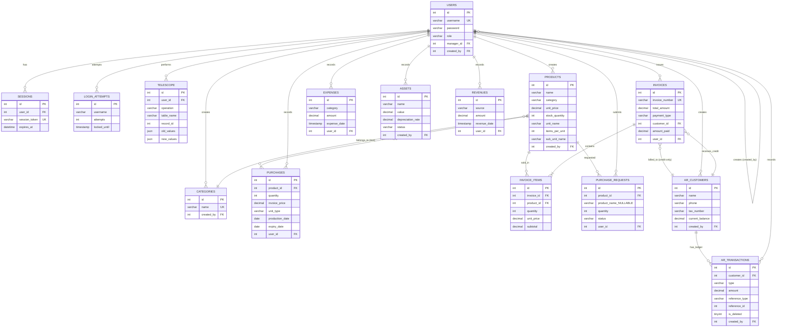

# Entity Relationship Diagram

## ERD Visual Representation



## Relationship Details

### User Hierarchy (Self-Referencing)

**Relationship**: `users.manager_id` → `users.id`

**Cardinality**: Many-to-One (N:1)

**Description**:

- Enables organizational hierarchy (managers → staff)
- Sales users typically have a manager assigned
- Managers may have multiple staff members
- NULL allowed (e.g., admin has no manager)

**Business Logic**:

```sql
-- Find all staff under manager 5
SELECT * FROM users WHERE manager_id = 5;

-- Find manager of user 10
SELECT m.* FROM users m 
JOIN users u ON u.manager_id = m.id 
WHERE u.id = 10;
```

### User Audit (Self-Referencing)

**Relationship**: `users.created_by` → `users.id`

**Cardinality**: Many-to-One (N:1)

**Description**:

- Tracks who created each user account
- NULL for seed admin user
- Used for audit trail

### Sessions **(Authentication)**

**Relationship**: `sessions.user_id` → `users.id`

**Cardinality**: Many-to-One (N:1)

**Cascade**: DELETE (when user deleted, sessions removed)

**Description**:

- One user can have multiple active sessions (multi-device login)
- Each session belongs to exactly one user
- Expired sessions not auto-deleted (manual cleanup needed)

### Product-Purchase

**Relationship**: `purchases.product_id` → `products.id`

**Cardinality**: Many-to-One (N:1)

**Cascade**: DELETE (when product deleted, purchase history removed)

**Description**:

- Product can have many purchase records over time
- Each purchase for one specific product
- Maintains cost history and pricing evolution

**Business Impact**:

```sql
-- Get latest purchase price for product 5
SELECT invoice_price FROM purchases 
WHERE product_id = 5 
ORDER BY purchase_date DESC 
LIMIT 1;
```

### Invoice-InvoiceItems

**Relationship**: `invoice_items.invoice_id` → `invoices.id`

**Cardinality**: One-to-Many (1:N)

**Cascade**: DELETE (when invoice deleted, items removed)

**Description**:

- Invoice header contains metadata (number, total, payment type)
- Invoice items contain line-level detail
- Standard header-detail pattern

**Business Logic**:

```sql
-- Total should equal sum of item subtotals
SELECT i.total_amount, SUM(ii.subtotal) as calculated_total
FROM invoices i
JOIN invoice_items ii ON i.id = ii.invoice_id
WHERE i.id = 123
GROUP BY i.id;
```

### Product-InvoiceItems

**Relationship**: `invoice_items.product_id` → `products.id`

**Cardinality**: Many-to-One (N:1)

**Cascade**: DELETE (when product deleted, invoice items removed)

**Description**:

- Product can appear on many invoices
- Invoice item snapshot `unit_price` at sale time
- Allows price history analysis

**Denormalization**: `unit_price` stored in invoice_items (not calculated from products.unit_price)

**Rationale**: Historical accuracy (product price may change after sale)

### AR Customer-Invoice (Credit Sales)

**Relationship**: `invoices.customer_id` → `ar_customers.id`

**Cardinality**: Many-to-One (N:1)

**Optional**: NULL for cash sales

**Description**:

- Only credit sales have customer_id populated
- Customer can have multiple invoices outstanding
- Used for filtering invoices by customer

### AR Customer-Transactions (Ledger)

**Relationship**: `ar_transactions.customer_id` → `ar_customers.id`

**Cardinality**: Many-to-One (N:1)

**Cascade**: DELETE (when customer deleted, ledger removed)

**Description**:

- Customer has ledger of debits/credits
- Transaction types:
  - `invoice`: Debit (increases debt)
  - `payment`: Credit (decreases debt)
  - `return`: Credit (decreases debt)
- Soft deletes maintain history

**Balance Calculation**:

```sql
UPDATE ar_customers SET current_balance = (
    SELECT 
        COALESCE(SUM(CASE WHEN type = 'invoice' THEN amount ELSE 0 END), 0) -
        COALESCE(SUM(CASE WHEN type != 'invoice' THEN amount ELSE 0 END), 0)
    FROM ar_transactions
    WHERE customer_id = ar_customers.id AND is_deleted = 0
);
```

### Purchase Request-Product

**Relationship**: `purchase_requests.product_id` → `products.id`

**Cardinality**: Many-to-One (N:1)

**Optional**: NULL if requesting new product (not in catalog yet)

**Description**:

- Request can reference existing product OR suggest new one
- If `product_id` NULL, `product_name` contains suggested name
- Enables procurement of both existing and new items

### User-CreatedRecords (Audit Trail)

**Multiple Relationships**:

- `products.created_by` → `users.id`
- `categories.created_by` → `users.id`
- `purchases.user_id` → `users.id`
- `invoices.user_id` → `users.id`
- `ar_customers.created_by` → `users.id`
- `ar_transactions.created_by` → `users.id`
- `expenses.user_id` → `users.id`
- `assets.created_by` → `users.id`
- `revenues.user_id` → `users.id`

**Cardinality**: All Many-to-One (N:1)

**Cascade**: SET NULL (preserve records if user deleted)

**Description**:

- Tracks which user created/modified record
- Enables accountability reporting
- Complements telescope audit log

### Telescope-All Tables (Audit Log)

**Relationship**: `telescope.user_id` → `users.id`

**Relationship**: `telescope.(table_name, record_id)` → `{table}.id` (logical, not FK)

**Description**:

- Logs all CREATE, UPDATE, DELETE operations
- `table_name` + `record_id` logically reference affected record
- JSON snapshots preserve before/after state
- No CASCADE (audit log immutable)

## Data Flow Diagrams

### Sale Transaction Flow

```batch
┌─────────┐     ┌─────────┐     ┌──────────────┐
│ Invoice │────→│  Items  │────→│   Products   │
└─────────┘     └─────────┘     │ (stock -= qty)│
     │                          └──────────────┘
     │ (if credit)
     ↓
┌─────────────┐     ┌────────────────┐
│ AR Customer │←────│ AR Transaction │
│ (balance += total) │ (type=invoice) │
└─────────────┘     └────────────────┘
                            ↓
                    (if amount_paid > 0)
                    ┌────────────────┐
                    │ AR Transaction │
                    │ (type=payment) │
                    └────────────────┘
```

### Purchase Transaction Flow

```batch
┌──────────┐     ┌──────────┐
│ Purchase │────→│ Products │
└──────────┘     │(stock += qty)│
                 │(price updated)│
                 └──────────┘
```

### Balance Sheet Data Flow

```batch
        ┌───────────┐
        │ Invoices  │──→ Total Sales
        └───────────┘
        
        ┌───────────┐
        │ Revenues  │──→ Other Revenues
        └───────────┘
        
        ┌───────────┐
        │ Purchases │──→ Total Purchases (COGS)
        └───────────┘
        
        ┌───────────┐
        │ Expenses  │──→ Total Expenses
        └───────────┘
                        ↓
                Cash Estimate = (Sales + Revenues) - (Purchases + Expenses)
        
        ┌───────────┐
        │ Products  │──→ Stock Value = SUM(unit_price × stock_quantity)
        └───────────┘
        
        ┌───────────┐
        │  Assets   │──→ Fixed Assets = SUM(value WHERE status='active')
        └───────────┘
        
        ┌─────────────┐
        │AR Customers │──→ Accounts Receivable = SUM(current_balance)
        └─────────────┘
                        ↓
                Total Assets = Cash + Stock + Fixed + AR
```

## Integrity Constraints

### Referential Integrity

**Enforced via Foreign Keys**:

- All foreign keys use InnoDB constraint mechanism
- Actions:
  - CASCADE: sessions, invoice_items, ar_transactions
  - SET NULL: Most user references (preserve data if user deleted)

**Not Enforced**:

- `products.category` → `categories.name` (text field, not FK)
- `ar_transactions.reference_id` → `{reference_type}.id` (dynamic FK)

### Domain Integrity

**Constraints**:

- UNIQUE: username, session_token, invoice_number, category name
- NOT NULL: Core identifiers, amounts, dates
- DEFAULT: Timestamps, status flags, numeric zeros
- CHECK (via application): positive amounts, valid roles

### Business Rules (Application-Level)

1. **Stock Availability**: Cannot sell more than `stock_quantity`
2. **Credit Requirement**: If payment_type='credit', customer_id required
3. **Unit Conversion**: Purchase quantity converted based on unit_type
4. **Balance Consistency**: AR customer balance = SUM(ledger transactions)
5. **Soft Delete**: AR transactions marked deleted, not physically removed
6. **Price Snapshot**: Invoice items store price at sale time
7. **Audit Immutability**: Telescope records never updated/deleted

## Indexing Strategy

### Existing Indexes

**Primary Keys**: Clustered index on all tables
**Unique Constraints**: username, session_token, invoice_number, category name
**Foreign Keys**: Automatic non-clustered indexes on FK columns

### Recommended Additional Indexes

```sql
-- For frequent lookups
CREATE INDEX idx_products_category ON products(category);
CREATE INDEX idx_purchases_product_date ON purchases(product_id, purchase_date DESC);
CREATE INDEX idx_telescope_table_time ON telescope(table_name, created_at DESC);
CREATE INDEX idx_ar_trans_customer_date ON ar_transactions(customer_id, transaction_date DESC);
```

## Transaction Boundaries

**Atomic Operations** (BEGIN...COMMIT):

1. **Invoice Creation**: invoice + items + stock updates + AR transactions
2. **Invoice Deletion**: item deletion + stock restoration + AR reversal
3. **Purchase Creation**: purchase + product stock/price update
4. **AR Balance Update**: Recalculation from ledger

**Isolation Level**: Default (REPEATABLE READ in InnoDB)

## Denormalization Decisions

**Denormalized Fields**:

1. `ar_customers.current_balance`: Calculated from ar_transactions, stored for performance
2. `invoice_items.unit_price`: Snapshot from products, preserves history
3. `invoice_items.subtotal`: Calculated field, stored for consistency

**Justification**:

- Avoids complex JOINs on every balance/invoice query
- Maintains historical accuracy (prices change over time)
- Trade-off: Update complexity vs. read performance

## Data Lifecycle

### Data Retention

**Permanent** (never deleted):

- Users (unless manually removed)
- Products (unless manually removed)
- Invoices and items (transactional history)
- Telescope (audit log)

**Temporary** (can be deleted):

- Sessions (after expiry)
- Login attempts (after successful login)
- Purchase requests (after conversion or rejection)

**Soft Deleted**:

- AR Transactions (is_deleted flag)

### Archival Strategy

**Not Implemented**: Manual archival required if database grows large

**Recommendation**:

- Archive telescope entries older than 2 years
- Archive invoices older than 7 years (tax compliance)
- Do NOT archive AR transactions (perpetual debt history)
