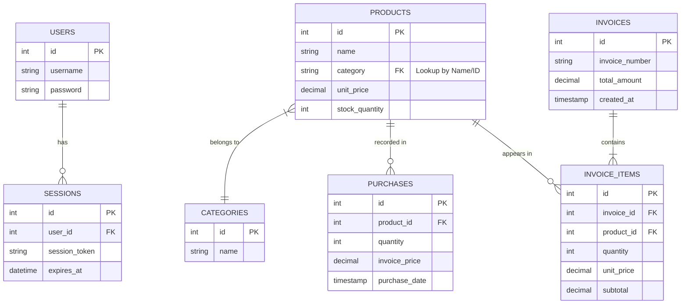

# Entity Relationship Diagram (ERD)

## Overview

The database schema is designed to support a transactional retail environment. The relationships are optimized for referential integrity and performance.

## Mermaid Diagram

## Relationships and Cardinality

### 1. Users to Sessions (1:M)

- A single user can have multiple active or historical sessions. Each session belongs to exactly one user.
- **Why**: Supports multi-device logins and session tracking for security.

### 2. Products to Categories (N:1)

- Each product belongs to one specific category. A category can house many products.
- **Why**: Enables efficient filtering and organization of the inventory.

### 3. Products to Purchases (1:M)

- A product can have multiple purchase records over time as new stock arrives.
- **Why**: Keeps a chronological history of stock acquisition and price changes.

### 4. Invoices to Invoice Items (1:M)

- An invoice acts as a header for multiple line items.
- **Why**: Essential for tracking exactly what was sold in a single transaction.

### 5. Products to Invoice Items (1:M)

- A product can appear on many different invoices.
- **Why**: Tracks the sales performance and stock depletion of specific products.
